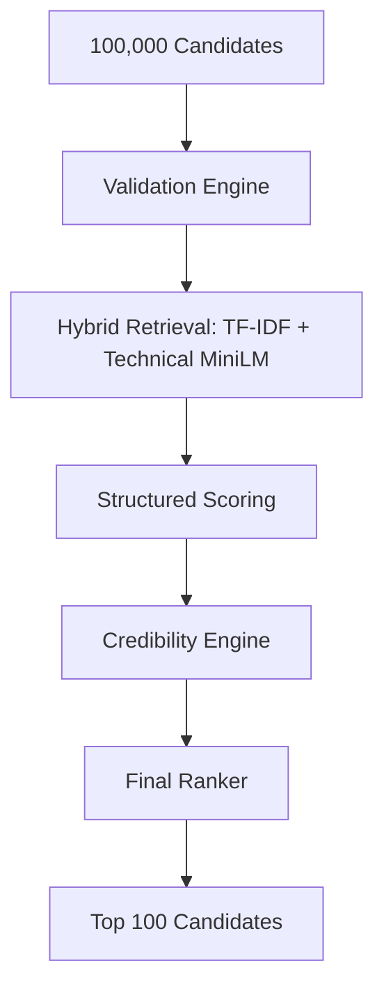

<div align="center">
  <h1>🎯 Scout</h1>
  <p><b>Deterministic, Evidence-Based Candidate Ranking Engine</b></p>
  <p><i>Evaluating high-volume, highly technical applicant pools by destroying keyword-stuffers and honeypots.</i></p>
</div>

> [!NOTE]
> Scout solves the critical recruiting challenge of distinguishing candidates who genuinely possess advanced AI/ML skills from those who simply keyword-stuff their resumes.

## ⚠️ The Problem

Recruiters hiring for highly specialized technical roles (like Senior AI Engineers) face the daunting task of reviewing thousands of profiles. In this environment, three major failure modes occur: 

1. **Keyword Stuffing**: Candidates artificially inject buzzwords like "LoRA" or "PyTorch" into skills arrays.
2. **Resume Inflation**: Candidates claim Senior titles with less than three years of experience.
3. **Semantic Mismatch**: Generic dense embeddings heavily weight non-technical corporate boilerplate over core engineering skills.

Ranking quality matters because if the system's top 100 candidates are dominated by keyword-stuffers and honeypots, the entire sourcing pipeline collapses, wasting critical engineering interview hours.

## 🏗️ Architecture

Scout replaces flawed heuristics with a multi-stage pipeline combining hybrid retrieval, objective structured scoring, and an aggressive credibility authentication engine to produce a mathematically defensible, recruiter-grade candidate shortlist.



- 🛡️ **Validation Engine**: A deterministic honeypot filter that permanently excludes logically impossible profiles (e.g., conflicting career dates, impossible salaries, behavioral clones).
- 🔍 **Hybrid Retrieval**: A dual-retrieval pipeline fetching the Top 1,000 candidates via sparse term matching (TF-IDF) and the Top 1,000 via dense embeddings (Technical MiniLM), creating a high-recall union pool.
- 🧮 **Structured Scoring**: A mathematical ranking layer that evaluates parsed candidate claims (Experience, Skills, Title) against the explicit constraints of the Job Description.
- 🕵️ **Credibility Engine**: An authentication matrix that cross-references candidate claims (like dropdown skills) against their actual career narrative and work history text to penalize contradictions.
- 🏆 **Final Ranker**: An orchestrator that applies a retrieval confidence multiplier and generates deterministic, recruiter-style reasoning strings for the final Top 100 output.

## 🛠️ Tech Stack

| Layer | Tool | Purpose |
|:---|:---|:---|
| Embeddings | `all-MiniLM-L6-v2` | Dense candidate + JD embeddings |
| Sparse Retrieval | `scikit-learn TF-IDF` | Keyword-based candidate retrieval |
| Feature Store | `pyarrow / pandas` | `candidate_features.parquet` — precomputed once |
| API | `FastAPI + Uvicorn` | REST endpoint, ~3s warm response |
| Validation | `Pydantic v2` | Request/response schema enforcement |
| Frontend | `Next.js + React` | Recruiter UI (local) |

## 🚀 Running Locally

> [!IMPORTANT]
> Scout runs locally. Ensure you have downloaded the large artifacts before starting the API.

### Prerequisites
- Python 3.11+
- Download artifacts (see `artifacts/README.md`)

### Generate Artifacts (first time only)
```bash
# Step 1 — Build feature store and embeddings (requires candidates.jsonl)
python scout/pipeline/build_embeddings.py

# Step 2 — Run validation engine
python scout/pipeline/validation_engine.py

# Step 3 — Generate submission CSV
python scout/pipeline/final_ranker.py
# Output: submission_final.csv
```

### Backend Setup
```bash
pip install -r requirements.txt
uvicorn api.main:app --reload
# API available at http://localhost:8000
```

### Frontend Setup (optional)
```bash
cd frontend
npm install
npm run dev
# UI available at http://localhost:3000
```

### Test the Pipeline
```bash
curl -X POST http://localhost:8000/rank-candidates \
  -H "Content-Type: application/json" \
  -d '{"jd_text": "Senior AI Engineer, 5-9 years, Python, PyTorch, RAG, LoRA, FAISS"}'
# Returns top 100 candidates in ~3 seconds
```

## 📊 Retrieval Experiments & Key Findings

During the development of our retrieval engine, an extensive experiment was conducted to determine the optimal embedding strategy.

| Retrieval Method | Relevant Roles in Top 20 | Result |
| :--- | :--- | :--- |
| **TF-IDF Baseline** | 20/20 | *Vulnerable to keyword stuffing ("LoRA", "QLoRA").* |
| **Full JD MiniLM** | 0/20 | *Failed via semantic washout on corporate boilerplate.* |
| **Technical JD MiniLM** | 20/20 | *Retrieved entirely different candidates than TF-IDF. Success.* |

> [!TIP]
> The experiment conclusively proved that full JD embeddings fail because of semantic washout, while technical JD embeddings succeed. Furthermore, TF-IDF and Technical MiniLM retrieved entirely different candidate cohorts, directly motivating our **Hybrid Retrieval** architecture.

## 📈 Scoring Formula

Candidates who reach the Structured Scoring stage are evaluated on five domains.

| Domain | Weight | Description |
| :--- | :--- | :--- |
| **Career Fit** | 40% | Checks `current_title` and `career_history` for exact role progression. |
| **Skills Fit** | 30% | Matches required/preferred skills, rewarding evidence strength. |
| **Experience Fit** | 20% | Evaluates exact `years_exp` against the JD bounds. |
| **Education Fit** | 5% | Minor bumps for STEM and advanced degrees. |
| **Location Fit** | 5% | Basic matching for remote logistics and target regions. |

These weights ensure that a candidate *must* possess the correct tenure and role history to score highly, heavily diluting the impact of simply having an impressive education or location.

**Final Ranking Equation:**
```text
Final Score = Structured Score * (Credibility Score / 100.0) * Retrieval Confidence
```
*(Retrieval Confidence = 1.15 if candidate was found by BOTH TF-IDF and MiniLM, otherwise 1.0)*

**Example — CAND_0005260 (Rank #1):**
| Component | Calculation | Score |
|:---|:---|---:|
| Experience (5.2y, range 5–9) | 1.00 × 0.20 | 0.200 |
| Skills (NLP, Embeddings, Python) | 0.46 × 0.30 | 0.138 |
| Career (Senior NLP Engineer) | 1.00 × 0.40 | 0.400 |
| Education + Location | — | 0.085 |
| **Structured Score** | | **0.8234** |
| × Credibility (95/100) | × 0.95 | 0.7822 |
| × Retrieval Confidence | × 1.00 | **0.7822** |

## 🕵️ The Credibility Engine

The Credibility Engine serves as Scout's primary defense against resume fraud. Instead of relying on expensive, non-deterministic LLM APIs, it utilizes deterministic Python text analysis to cross-reference claims against textual evidence.

- ❌ **Skills-Narrative Contradictions**: Detects if high-value AI skills are selected in a dropdown array but never actually written about in the candidate's work history.
- 📈 **Skill Inflation**: Identifies candidates listing a mathematically impossible number of skills relative to their experience.
- 📦 **Keyword Stuffing**: Flags exceptionally high skill counts with low overall text volume.
- 👑 **Inflated Titles**: Penalizes candidates claiming "Principal" or "Director" titles with fewer than four years of experience.
- 🏃 **Career Instability**: Identifies job-hoppers based on high job counts over short tenures.

If a contradiction is found, the engine deducts points from a starting score of 100. This acts as a percentage multiplier, significantly reducing the rank of deceptive candidates.

## 🛑 Honeypot Analysis

The Validation Engine aggressively cleaned the raw 100,000 JSONL candidate pool by identifying logical impossibilities, permanently excluding **2,165 honeypots**.

| Stage | Candidates |
| :--- | ---: |
| Raw Dataset | 100,000 |
| After Validation | 97,835 |
| TF-IDF Retrieval | 1,000 |
| MiniLM Retrieval | 1,000 |
| Union Pool | 1,978 |
| **Final Ranked Output** | **100** |

*Union pool size varies by JD — 1,978 reflects the challenge dataset job description.*

> [!WARNING]
> **Case Study: The Keyword-Stuffing Trap**
> Candidate `CAND_0000970` possessed the title "Data Engineer". They injected the highly-coveted term "LoRA" into their skills array.
> - **Retrieval**: TF-IDF ranked the candidate in the top 5% (#5,406).
> - **Scoring**: Applied a moderate penalty because "Data Engineer" was not the ideal target title.
> - **Credibility**: Identified a **Skills-Narrative Contradiction**: the candidate claimed "LoRA" proficiency, but never wrote about fine-tuning or LLMs anywhere in their multi-paragraph career history. The candidate was removed from the final ranking.

## ⚡ Performance & Constraints

Scout is designed to be highly performant and deterministic.

- **CPU-Only Execution**: The entire pipeline executes entirely on standard CPU instances.
- **No Runtime LLM Calls**: By using rigorous python logic and deterministic array comparisons, Scout avoids the latency, cost, and hallucination risks of executing LLM API calls on 100,000 rows.
- **Deterministic Pipeline**: Because there is no stochastic generation at runtime, candidate scores are 100% reproducible and mathematically auditable.

## 📁 Repository Structure

```text
Scout/
├── api/
│   └── main.py                    # FastAPI live ranking endpoint
├── scout/
│   └── pipeline/
│       ├── validation_engine.py   # Honeypot exclusion
│       ├── build_embeddings.py    # Feature store + embeddings
│       ├── minilm_ranker.py       # Dense retrieval
│       ├── structured_scorer.py   # Domain scoring
│       ├── credibility_engine.py  # Anti-fraud engine
│       ├── reasoning.py           # Reasoning string generator
│       └── final_ranker.py        # Orchestration + CSV output
├── artifacts/
│   └── README.md                  # How to download large files
├── frontend/                      # React UI (optional, local only)
├── submission_final.csv           # Final ranked output
├── requirements.txt
└── README.md
```

## 🔮 Future Work

While the core ranking engine is mathematically sound, future iterations of Scout will focus on:
1. **Advanced Fraud Detection**: Utilizing a lightweight local LLM on the final Top 500 to detect "AI-generated prose" stylistic inconsistencies in career narratives.
2. **Dynamic JD Adaptation**: Implementing an ingestion parser that automatically condenses any uploaded Job Description into the necessary structured format.
3. **Multi-Domain JD Support**: Extending the pipeline beyond AI/ML Engineering to support Product, Backend, and Data roles.
